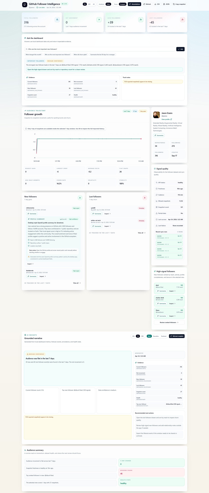
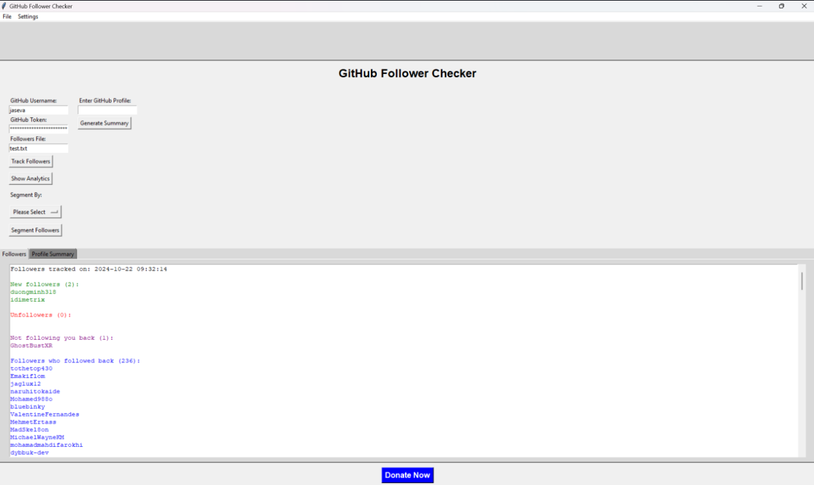
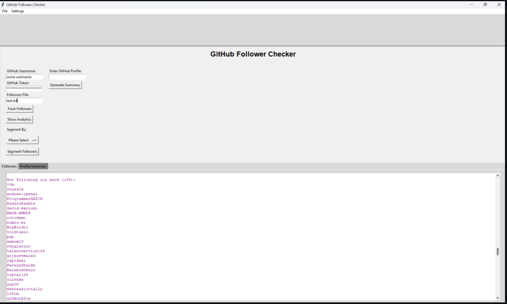
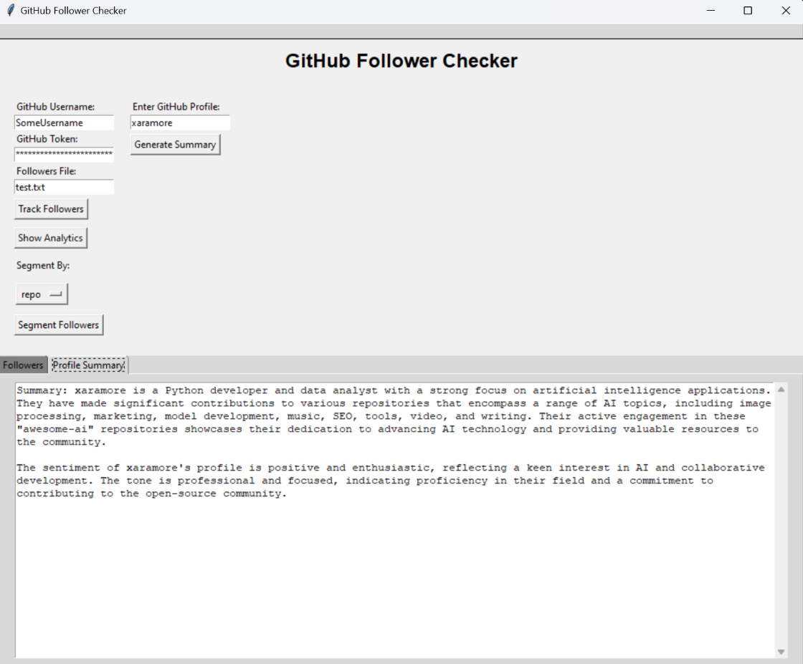
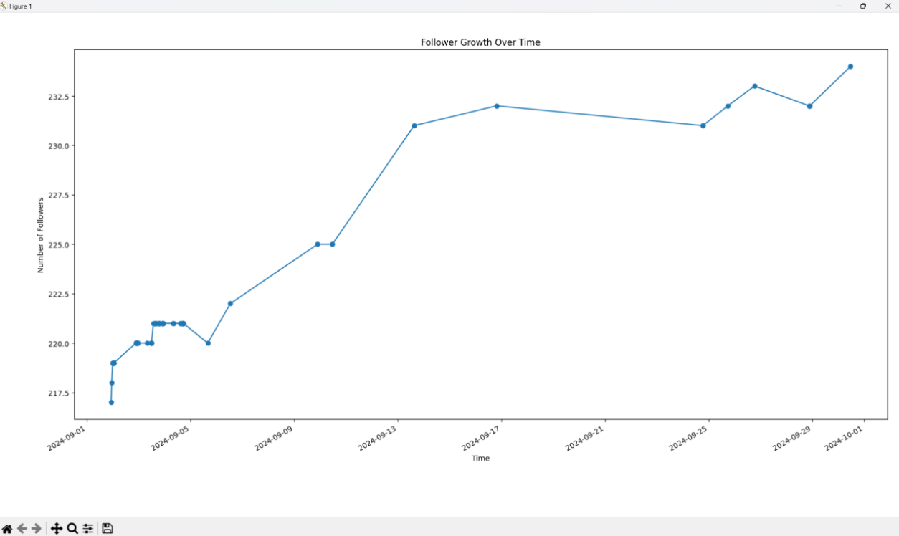
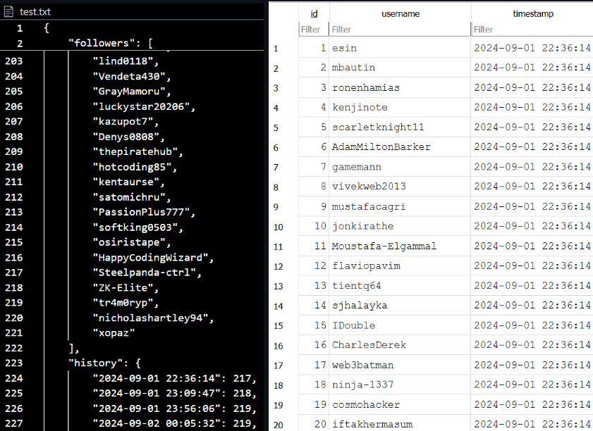

# GitHub Follower Checker

Track your GitHub follower count, follower changes, and profile growth trends with a polished ShadCN-style web dashboard and an optional Tkinter desktop utility.

The current recommended experience is the Next.js + FastAPI dashboard. It presents follower metrics, trend history, GitHub profile context, new/lost follower activity, and data quality signals in one dense analytics view.

## Application Experiences

This repo includes two user experiences with different goals:

- **ShadCN-style web dashboard:** the modern analytics dashboard built with Next.js, Tailwind CSS, Recharts, and FastAPI. Use this for the richest day-to-day follower intelligence experience.
- **Desktop application:** the original Tkinter app. Use this for local tracking, follower segmentation, Matplotlib charts, JSON follower history, and OpenAI profile summaries.

### ShadCN-Style Web Dashboard



### Desktop Tkinter Application

The desktop application is still useful for local workflows that need direct Tkinter controls, saved JSON history, Matplotlib charts, and OpenAI-generated GitHub profile summaries.

<table>
  <tr>
    <td width="50%">
      
      <p><strong>Follower tracking results</strong></p>
    </td>
    <td width="50%">
      
      <p><strong>Not-following-back view</strong></p>
    </td>
  </tr>
  <tr>
    <td width="50%">
      
      <p><strong>OpenAI profile summary</strong></p>
    </td>
    <td width="50%">
      
      <p><strong>Follower growth chart</strong></p>
    </td>
  </tr>
  <tr>
    <td width="50%">
      
      <p><strong>Saved follower history JSON</strong></p>
    </td>
    <td width="50%">
      <p>The desktop app screenshots show the legacy local workflow. The dashboard screenshot above shows the newer web analytics experience.</p>
    </td>
  </tr>
</table>

## Features

- **Follower intelligence dashboard** with total followers, 24-hour net movement, new followers, and lost followers.
- **Interactive growth chart** with 7-day, 30-day, and all-time range controls.
- **GitHub profile panel** with avatar, bio, public repositories, following count, and profile link.
- **Signal quality panel** with stability, monitoring window, data point count, and last sync.
- **Follower activity panels** for recent gained and lost followers.
- **FastAPI backend** that stores follower snapshots in SQLite and exposes dashboard endpoints.
- **Legacy Tkinter app** for local follower tracking, segmentation, charts, and OpenAI-powered profile summaries.

## Tech Stack

- **Frontend:** Next.js, React, TypeScript, Tailwind CSS, Recharts, Lucide icons
- **Backend:** FastAPI, Pydantic, SQLite, Requests
- **Desktop utility:** Python, Tkinter, Matplotlib, OpenAI SDK

## Prerequisites

- Python 3.10 or newer
- Node.js 18 or newer
- A GitHub personal access token
- Optional: an OpenAI API key for the Tkinter profile summary feature

## Environment Variables

Create a `.env` file in the repository root:

```env
GITHUB_USERNAME=your-github-username
GITHUB_TOKEN=your-github-token
OPENAI_API_KEY=your-openai-api-key
```

`OPENAI_API_KEY` is only required for the desktop profile summary feature. The web dashboard uses `GITHUB_USERNAME` and `GITHUB_TOKEN`.

The backend also supports `backend/.env` for local overrides. That file is ignored by git.

## Install

Install Python dependencies:

```sh
python -m pip install -r requirements.txt
python -m pip install -r backend/requirements.txt
```

Install frontend dependencies:

```sh
cd frontend
npm install
cd ..
```

## Run The Web Dashboard

Start the FastAPI backend:

```sh
python -m uvicorn app.main:app --app-dir backend --reload --host 127.0.0.1 --port 8000
```

In a second terminal, start the Next.js frontend:

```sh
cd frontend
npm run dev
```

Open:

```text
http://localhost:3000
```

The dashboard fetches data from:

- `GET http://localhost:8000/stats/profile`
- `GET http://localhost:8000/stats/followers`
- `GET http://localhost:8000/stats/trends`
- `GET http://localhost:8000/stats/history/new`
- `GET http://localhost:8000/stats/history/lost`

## Run A Production Build

```sh
cd frontend
npm run build
npm run start
```

Keep the FastAPI backend running on port `8000` while using the production frontend.

## Run The Desktop Tkinter App

The original desktop app is still available:

```sh
python main.py
```

Use it to:

- Track followers into `followers.json` and SQLite.
- View follower/unfollower charts with Matplotlib.
- Segment followers.
- Generate OpenAI summaries for GitHub profiles.

## Data Storage

- Web dashboard snapshots are stored in `backend/followers.db`.
- The Tkinter app stores local data in `follower_data.db` and `followers.json`.
- Local database and environment files are ignored by git.

## Project Structure

```text
.
├── backend/
│   └── app/
│       ├── api/
│       ├── services/
│       ├── main.py
│       └── models.py
├── frontend/
│   ├── app/
│   ├── lib/
│   └── package.json
├── docs/
│   └── screenshots/
│       ├── dashboard.png
│       └── desktop/
│           ├── followers-tracked.png
│           ├── not-following-back.png
│           ├── profile-summary.png
│           ├── follower-growth-chart.png
│           └── follower-history-json.png
├── main.py
├── analytics.py
├── requirements.txt
└── README.md
```

## Verify Changes

Backend/Python:

```sh
npx --yes pyright
python -m py_compile main.py analytics.py backend/app/api/stats.py backend/app/services/tracker.py
```

Frontend:

```sh
cd frontend
npm run build
```

## Updating Screenshots

With the backend and frontend running, capture a new dashboard screenshot:

```sh
npx --yes playwright screenshot --browser=chromium --viewport-size=1980,1250 --wait-for-timeout=3000 http://localhost:3000 docs/screenshots/dashboard.png
```

If Playwright asks for a browser install:

```sh
npx --yes playwright install chromium
```

Desktop application screenshots should be saved under `docs/screenshots/desktop/` using the filenames shown in the project structure above. The root README references those exact files.

## Notes

- GitHub follower history is based on snapshots taken when the app requests follower stats.
- The dashboard is optimized for desktop analytics use. It fits in one viewport on large desktop screens and becomes scrollable on smaller screens.
- Keep your `.env`, tokens, and local database files out of version control.

## License

This project is licensed under the MIT License. See [LICENSE](LICENSE).

## Support

If this project is useful, you can support it here:

[Donate](https://www.paypal.com/donate/?hosted_button_id=AQCPKNSDGMJLL)
