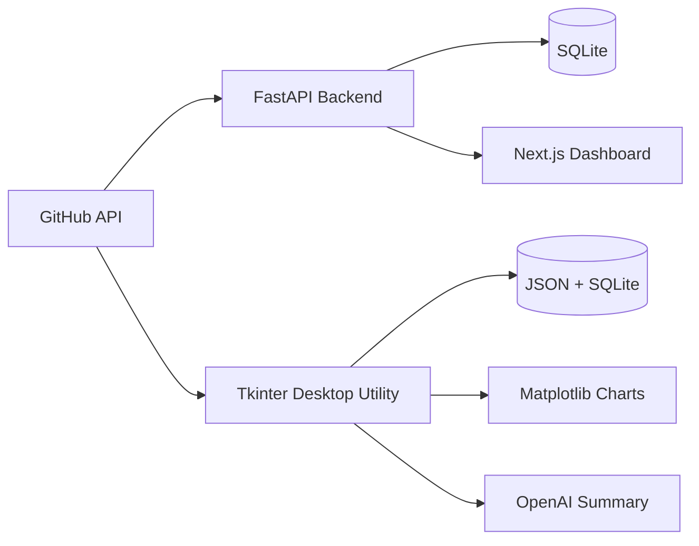

# GitHub Follower Checker

<p align="center">
  
  
  
  
  
  
</p>

<p align="center">
  A GitHub follower analytics project with two distinct experiences:
  <strong>a polished ShadCN-style web dashboard</strong> for dense, modern analytics and a
  <strong>desktop Tkinter utility</strong> for local tracking, charts, and AI profile summaries.
</p>

<p align="center">
  
</p>

## Why This Repo Stands Out

- **A real analytics surface, not just a counter.** Track follower trends, 24-hour movement, churn, activity, and profile context in one view.
- **Two workflows in one repo.** Use the web dashboard for a modern product experience and the Tkinter app for local utility workflows.
- **Practical data pipeline.** FastAPI backend, SQLite persistence, live GitHub API reads, and a responsive React frontend.
- **Built for extension.** The current structure supports future notifications, richer timeline analysis, segmentation, and more advanced summaries.

## Choose Your Experience

| Experience | Best For | Stack | What You Get |
| --- | --- | --- | --- |
| **Web dashboard** | Daily monitoring, demos, polished analytics | Next.js, React, Tailwind CSS, Recharts, FastAPI | KPI cards, trend chart, follower activity, GitHub profile panel, signal quality panel |
| **Desktop utility** | Local automation, direct controls, quick tracking | Python, Tkinter, Matplotlib, OpenAI SDK | Follower tracking, follower file output, segmentation, charts, AI profile summaries |

The recommended primary experience is the **web dashboard**.

## Core Features

- **Follower intelligence dashboard**
  - Total followers
  - 24-hour net movement
  - New followers
  - Lost followers
- **Interactive follower growth chart**
  - 7-day, 30-day, and all-time ranges
  - Snapshot-based growth tracking
- **GitHub profile context**
  - Avatar
  - Bio
  - Public repositories
  - Following count
  - Direct profile link
- **Signal quality panel**
  - Stability
  - Monitoring window
  - Data point count
  - Last sync timestamp
- **Desktop utility workflows**
  - Local follower tracking
  - JSON history file output
  - Matplotlib analytics
  - OpenAI-generated profile summaries

## Quick Start

### 1. Environment Variables

Create a `.env` file in the repository root:

```env
GITHUB_USERNAME=your-github-username
GITHUB_TOKEN=your-github-token
OPENAI_API_KEY=your-openai-api-key
```

`OPENAI_API_KEY` is optional and only required for the desktop profile summary workflow.

The backend supports `backend/.env` as a local override if you want to keep web-dashboard credentials separate.

### 2. Install Dependencies

Python:

```sh
python -m pip install -r requirements.txt
python -m pip install -r backend/requirements.txt
```

Frontend:

```sh
cd frontend
npm install
cd ..
```

### 3. Run The Web Dashboard

Start the FastAPI backend:

```sh
python -m uvicorn app.main:app --app-dir backend --reload --host 127.0.0.1 --port 8000
```

Start the frontend in a second terminal:

```sh
cd frontend
npm run dev
```

Open:

```text
http://localhost:3000
```

If `3000` is already in use, Next.js may fall back to `3001`. Local CORS is configured for both `3000` and `3001`.

## Dashboard API

The web app reads from these local endpoints:

- `GET /stats/profile`
- `GET /stats/followers`
- `GET /stats/trends`
- `GET /stats/history/new`
- `GET /stats/history/lost`

Base URL during development:

```text
http://localhost:8000
```

## Desktop Tkinter Utility

Run the legacy desktop application with:

```sh
python main.py
```

Use it to:

- Track followers into a local JSON file
- View follower and unfollower charts with Matplotlib
- Segment followers
- Generate GitHub profile summaries with OpenAI

The desktop application remains part of the repo because it is useful for local workflows and historical tracking, even though the dashboard is now the primary user experience.

<table>
  <tr>
    <td width="50%">
      
      <p><strong>Follower tracking results</strong></p>
    </td>
    <td width="50%">
      
      <p><strong>Not-following-back view</strong></p>
    </td>
  </tr>
  <tr>
    <td width="50%">
      
      <p><strong>OpenAI profile summary</strong></p>
    </td>
    <td width="50%">
      
      <p><strong>Follower growth chart</strong></p>
    </td>
  </tr>
  <tr>
    <td width="50%">
      
      <p><strong>Saved follower history JSON</strong></p>
    </td>
    <td width="50%">
      <p>The Tkinter app is the legacy local workflow. The web dashboard remains the primary experience for polished analytics, while the desktop tool is useful for direct local tracking and summaries.</p>
    </td>
  </tr>
</table>

## Architecture



## Project Structure

```text
.
├── backend/
│   └── app/
│       ├── api/
│       ├── services/
│       ├── main.py
│       └── models.py
├── frontend/
│   ├── app/
│   ├── components/
│   ├── lib/
│   └── package.json
├── docs/
│   └── screenshots/
│       ├── dashboard.png
│       └── desktop/
├── main.py
├── analytics.py
├── requirements.txt
└── README.md
```

## Local Data

- Web dashboard snapshots: `backend/followers.db`
- Desktop utility data: `follower_data.db` and local follower JSON files

Database files and environment files are ignored by git.

## Development Commands

Frontend production build:

```sh
cd frontend
npm run build
npm run start
```

Type and compile checks:

```sh
npx --yes pyright
python -m py_compile main.py analytics.py backend/app/api/stats.py backend/app/services/tracker.py
```

## Refreshing The Dashboard Screenshot

With the backend and frontend running:

```sh
npx --yes playwright screenshot --browser=chromium --viewport-size=1980,1250 --wait-for-timeout=3000 http://localhost:3000 docs/screenshots/dashboard.png
```

If Playwright needs Chromium installed:

```sh
npx --yes playwright install chromium
```

## Notes

- Follower growth is based on stored snapshots, so the historical chart improves as the app is used over time.
- The dashboard is optimized for desktop analytics and becomes scrollable on smaller viewports.
- Keep your `.env`, tokens, and local database files out of version control.

## License

This project is licensed under the MIT License. See [LICENSE](LICENSE).

## Support

If this project is useful, you can support it here:

[Donate](https://www.paypal.com/donate/?hosted_button_id=AQCPKNSDGMJLL)
